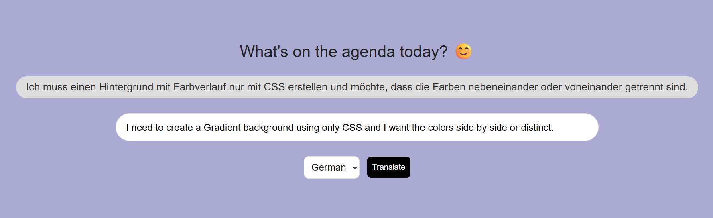

# AI-Powered Translator

An AI-powered web translator built with **Flask**, **JavaScript**, and the **Google Gemini API**.

The project started as an exploration of how an AI API can be integrated into a traditional web application and turned into a simple, responsive translation experience.



## ✨ What it does

- Translate words, phrases, and sentences between languages
- Communicate with the backend without reloading the page
- Use Gemini to generate translations
- Keep the API key outside the source code with environment variables
- Provide a simple interface for interacting with the translator

## 🧱 Architecture

```text
Browser
   │
   │ Fetch / AJAX
   ▼
Flask API
   │
   │ Gemini API request
   ▼
Google Gemini
   │
   ▼
Translation response
   │
   ▼
Browser
```

The frontend uses vanilla JavaScript and the Fetch API to communicate with Flask asynchronously. Flask handles the server-side logic and communicates with Gemini.

## 🛠️ Built With

- Python
- Flask
- Google Gemini API
- JavaScript
- Fetch API
- HTML5
- CSS3
- python-dotenv

## 📂 Project Structure

```text
translator/
├── app.py
├── requirements.txt
├── .env
├── templates/
│   └── index.html
└── static/
    └── index.css
```

## 🚀 Run Locally

### 1. Clone the repository

```bash
git clone https://github.com/atef7534/AI-Powered-Translator.git
cd AI-Powered-Translator
```

### 2. Create a virtual environment

Windows:

```bash
python -m venv venv
venv\Scripts\activate
```

macOS/Linux:

```bash
python3 -m venv venv
source venv/bin/activate
```

### 3. Install dependencies

```bash
pip install -r requirements.txt
```

### 4. Add your Gemini API key

Create a `.env` file:

```env
GEMINI_API_KEY=your_api_key_here
```

**Never commit your real API key to GitHub.**

### 5. Start the application

```bash
python app.py
```

Open:

```text
http://127.0.0.1:5000
```

## 🧠 What I Learned

This project helped me understand the complete path of an AI-powered web request:

**User input → frontend request → Flask backend → AI API → response → UI**

It also gave me practical experience with:

- Integrating an external AI API
- Environment variables and secret management
- Flask routes
- Asynchronous browser requests
- Separating frontend and backend responsibilities
- Designing a small but complete AI-powered application

## 🔮 Possible Next Steps

If I continue developing this project, I'd like to add:

- Translation history
- More control over translation style
- Better error handling and loading states
- Automated tests
- User accounts and saved translations
- Streaming responses where appropriate

---

**Built by Atif Yasser** · [GitHub](https://github.com/atef7534) · [LinkedIn](https://www.linkedin.com/in/atif-yasser/)
